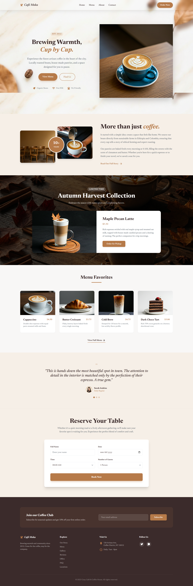
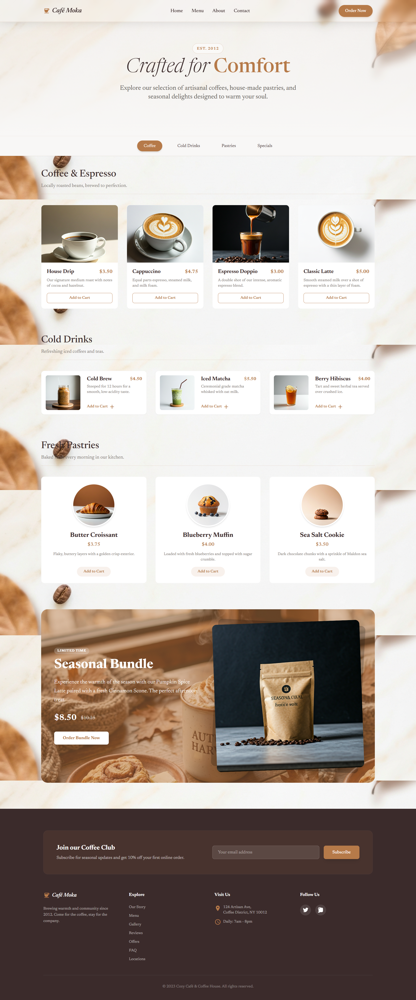
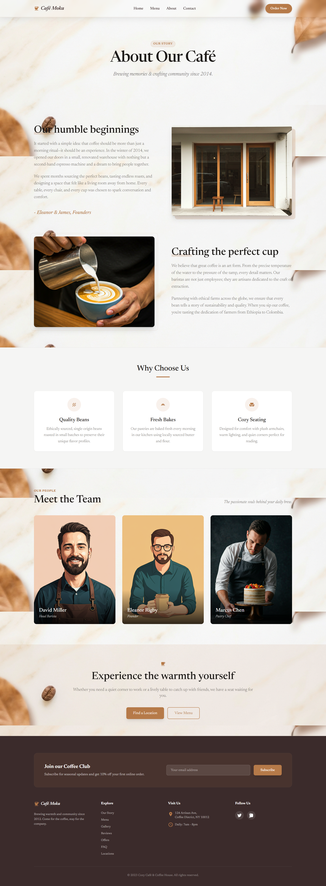
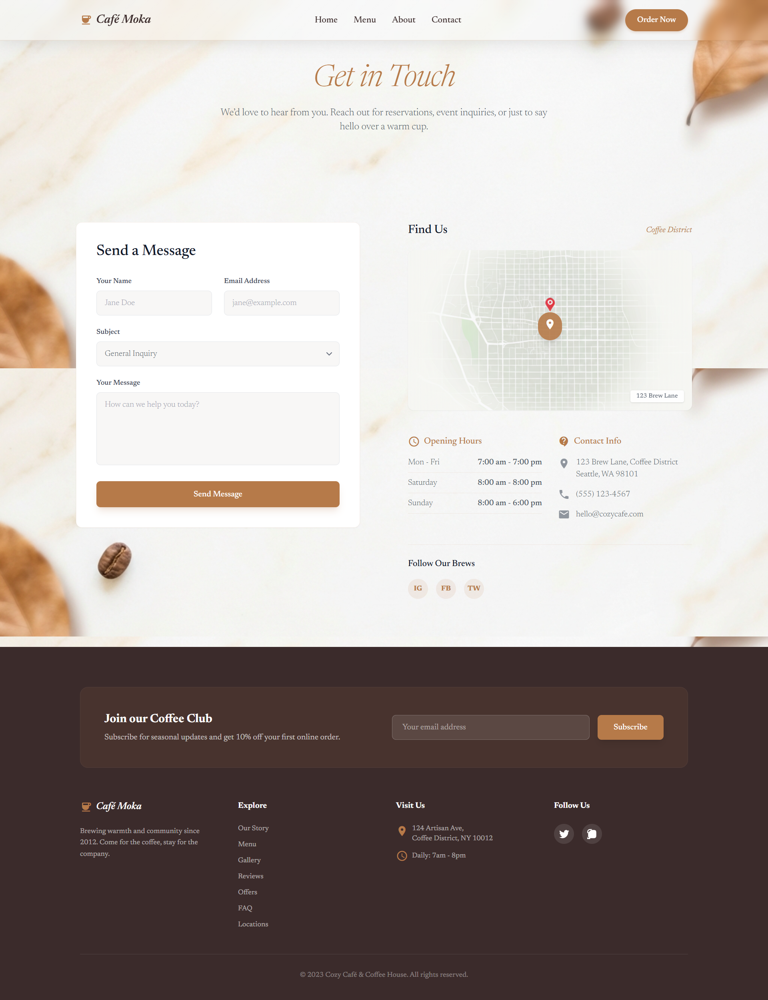
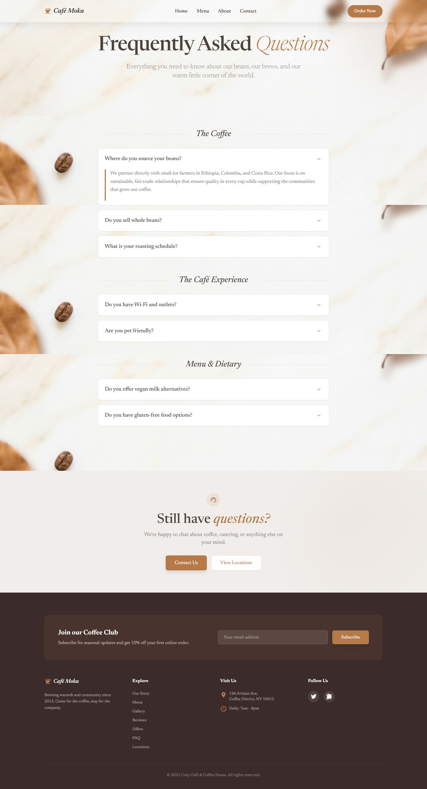
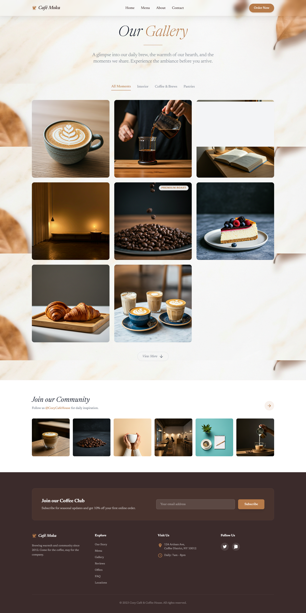
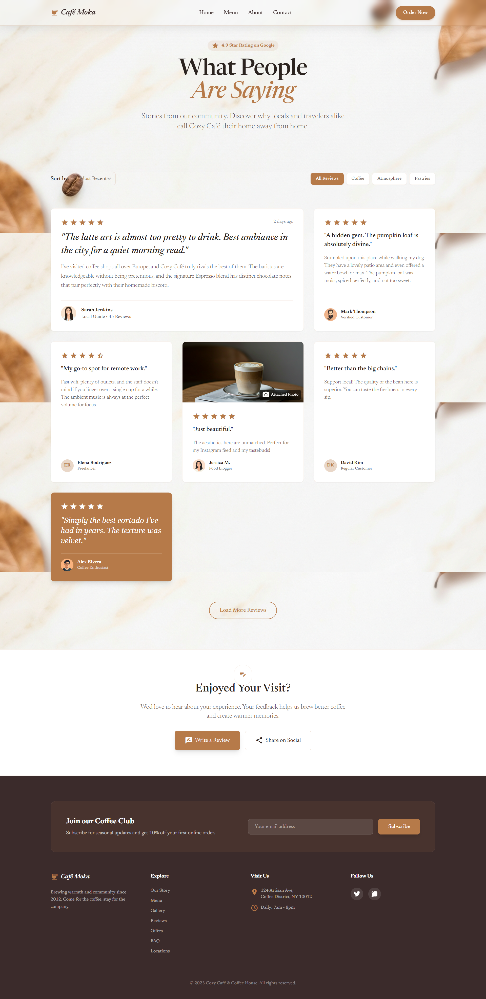
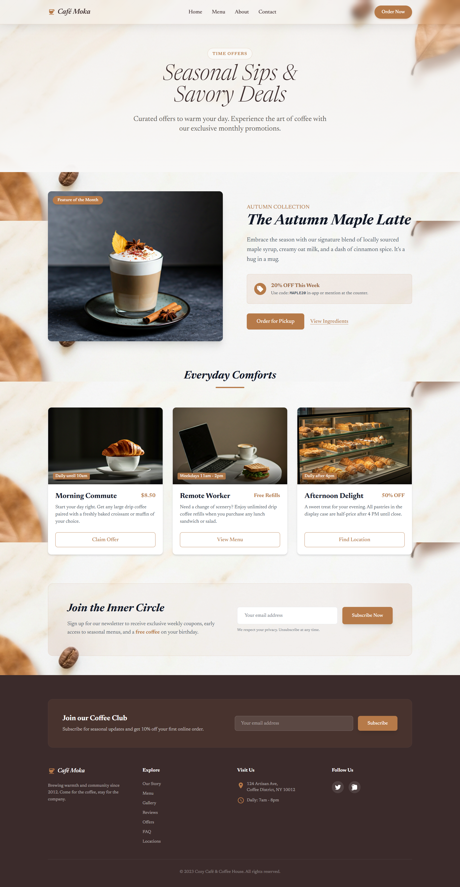

# Cafe Moka ☕

Welcome to the **Cafe Moka** website project! This application is a modern, responsive web platform designed for a premium coffee shop experience. It showcases our menu, special offers, reviews, and gallery, inviting customers to experience warmth, cup by cup.

## 🌟 About The Project

Cafe Moka is an artisan coffee shop website built with **Laravel**. It features a clean, aesthetic design with:

- **Responsive Layout**: Optimized for desktop, tablet, and mobile.
- **Dynamic Content**: Sections for menus, reviews, and special offers.
- **Modern UI**: Utilizing Tailwind CSS for a sleek, premium look.

## 🚀 Routes & Pages

The application is structured around the following main routes, each corresponding to a specific view.

| Page Name          | Route                  | Description                                             |
| ------------------ | ---------------------- | ------------------------------------------------------- |
| **Home**           | `/`                    | The landing page featuring hero section and highlights. |
| **Menu**           | `/menu.html`           | Our complete coffee and pastry offerings.               |
| **About**          | `/about.html`          | Our story, origin of beans, and values.                 |
| **Contact**        | `/contact.html`        | Location, hours, and contact form.                      |
| **FAQ**            | `/faq.html`            | Frequently asked questions.                             |
| **Gallery**        | `/gallery.html`        | Visual tour of our cafe and latte art.                  |
| **Reviews**        | `/reviews.html`        | Customer testimonials and feedback.                     |
| **Special Offers** | `/special-offers.html` | Seasonal bundles and limited-time deals.                |

---

## 📸 Screenshots

Here is a visual tour of the application pages:

### 🏠 Home Page

### 📜 Menu

### ℹ️ About Us

### 📞 Contact

### ❓ FAQ

### 🖼️ Gallery

### ⭐ Reviews

### 🎁 Special Offers

---

## 📝 License

This project is open-sourced software licensed under the [MIT license](https://opensource.org/licenses/MIT).
